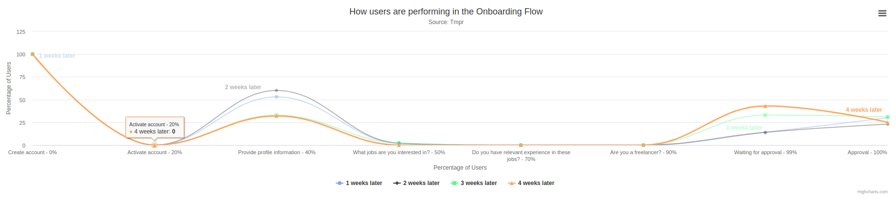

# Tmpr PHP assesment
This assessment aims to gauge your development skills with the focus being on back-end using PHP. We will be paying attention to your approach to solving the problem, the structure of your code, and adherence to best practices and design principles.



### Requirements of the assesment:
Create chart according to the provided requirements in the separate document.

### Technologies
- Plain PHP
- CSV file as database
- Docker
- Docker Compose
- HighChart (JavaScript library)
- PhpUnit 8
- Bash
- Git

### Prerequisites
Docker.io and docker-compose must be installed in the system in order to be able to use the app.
OS Linux

## How to setup the application:
```bash
git clone https://github.com/belushkin/tmpr.git
cd tmpr; ./toolbox.sh up
```

## Basic script usage:
Application has *toolbox.sh* script. It is very easy run, stop, ssh, rebuild, run tests and stop the application.

```bash
./toolbox.sh up # run the application
./toolbox.sh rebuild # rebuild the image
./toolbox.sh ssh # ssh to the container
./toolbox.sh tests # run tests
./toolbox.sh down # stop the application
```

### URL of the running app
http://localhost:8080/

## Contributors
@belushkin

## License
MIT License
